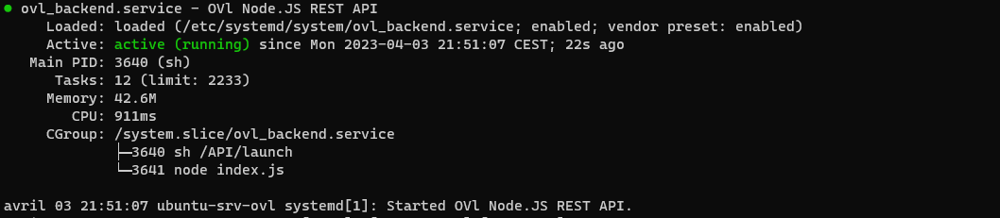

# Installation instructions of Backend Services

## First of all you need to check the list of the requirement bellow

1. Have a linux environnement with APT package manager.
2. Have SuperUser (root / sudo) rights on the machine.
3. Know how to run commands in a shell (cd chmod etc...) .

## How to install ?

Here is the install process

1. Clone the repo to your linux root (/)
2. Run the following command with root privileges : `cd /API/Install && chmod +x ./Install.sh && ./Install.sh`
3. Follow the install progress, after run the following command `systemctl status ovl_backend.service`, if all goes right you will see something like [this](https://github.com/eziocangialosi/OVL-Backend/blob/master/Install/image/1680551717284.png "Screenshot of OVL Backend systemd service.")

## How to configure ?

To configure all the backend REST API you just need to edit the [config.js](https://github.com/eziocangialosi/OVL-Backend/blob/master/API/API/config.js "REST API Config file.").

After editing the [config.js](https://github.com/eziocangialosi/OVL-Backend/blob/master/API/API/config.js "REST API Config file.") file you need to restart the ovl_backend systemd service, to do this you need to run the following command with root privileges :  `systemctl restart ovl_backend.service && systemctl status ovl_backend.service`.
